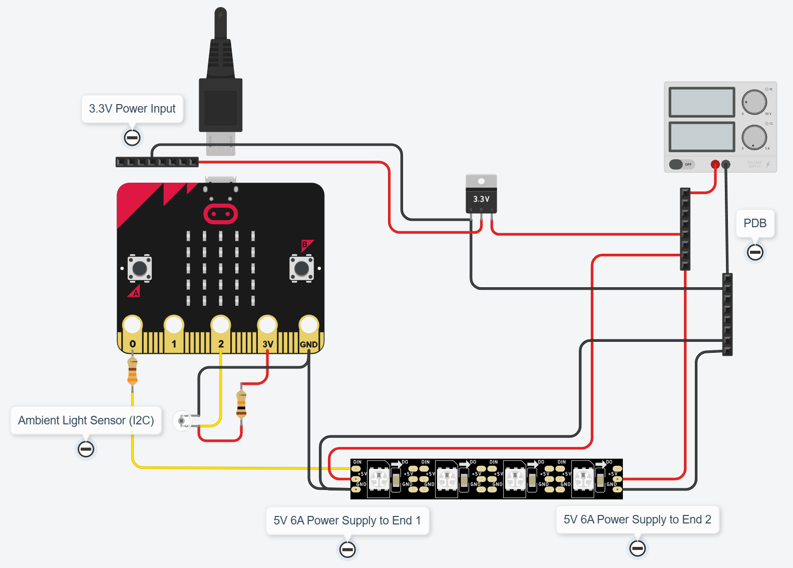

# Micro:bit V2 Interactive LED Strip with Motion and Light Sensing

This project showcases how to create an interactive LED strip experience using a Micro:bit V2 board, a VEML6030 ambient light sensor, and a WS2812B addressable LED strip. 

## Features

* **Multiple Modes:**
    * **Lights ON:** LEDs display a static pattern, controlled by button B.
    * **Lights OFF:**  All LEDs are turned off.
* **Button Control:**
    * Button A: Cycles through the different modes.
    * Button B: Changes the LED animation pattern (in Lights ON mode).
* **Ambient Light Sensing:** The VEML6030 sensor adjusts the brightness of the LEDs based on the surrounding light levels.
* **WS2812B LED Strip:**  Utilizes the `WS2812FX` library for a variety of captivating LED animation patterns.

## Hardware Requirements

* Micro:bit V2 board (https://core-electronics.com.au/micro-bit-v2-go-kit-australia.html)
* PiicoDev Adapter for Micro:bit (https://core-electronics.com.au/piicodev-adapter-for-micro-bit.html)
* PiicoDev Platform for Micro:bit (https://core-electronics.com.au/piicodev-platform-for-micro-bit.html)
* VEML6030 ambient light sensor (https://core-electronics.com.au/piicodev-ambient-light-sensor-veml6030.html)
* WS2812B addressable LED strip (adjust length and power supply as needed) (https://core-electronics.com.au/digital-rgb-led-strip-120-led-black.html)
* Jumper wires (I2C / Qwiic compatible)
* DC Barrel Jack Adapter (https://core-electronics.com.au/dc-barrel-jack-adapter-female.html)
* Some vero board to solder PDB
* Flexible Silicone LED Tube (T0513) (https://vi.aliexpress.com/item/1005007522578245.html)
* Matching Plastic Led Connector Clips (https://vi.aliexpress.com/item/1005007014259584.html)
* Power Adapter (5.5*2.1~2.5mm, Female Connector, 5V 6A) (https://vi.aliexpress.com/item/33042352760.html)
* 16AWG Silicone Wires (https://vi.aliexpress.com/item/1005002911374376.html)
* PET Expandable Cable Sleeve (6mm) to hide wires (https://vi.aliexpress.com/item/1005001728771890.html)
* Transparent Acrylic Sheet Board (3mm) (https://vi.aliexpress.com/item/1005006408573271.html)
* M3 Hex Brass Standoffs Assortment Kit (https://vi.aliexpress.com/item/1005007511529003.html)
* Cutter For Acrylic Plastic Sheet (optional) (https://vi.aliexpress.com/item/1005004994830361.html)

## Software Requirements

* Arduino IDE or PlatformIO
* Adafruit_Microbit library 
* SparkFun_VEML6030_Ambient_Light_Sensor library
* WS2812FX library

## Installation and Setup

1. **Clone or download this repository.**
2. **Install the required libraries.** 
3. **Connect the hardware components** according to the wiring diagram (provided below or in a separate file).
4. **Open the project** in your Arduino IDE or PlatformIO.
5. **Compile and upload** the code to your Micro:bit V2.

## Wiring Diagram

## Usage

1. **Power on** your Micro:bit V2.
2. **Press button A** to cycle through the modes.
3. **Press button B** to change the LED animation pattern (in Lights ON mode).
4. The LEDs will automatically adjust their brightness based on the ambient light.

## Customization

* Adjust the VEML6030 sensor settings and brightness mapping in `VEML6030.cpp` to fine-tune the light sensitivity.
* Modify the LED animation patterns or add new ones in `State.cpp` and `WS2812FX.h`.
* Experiment with different motion detection thresholds and LED responses in `main.cpp`.

## Contributing

Contributions are welcome! Feel free to submit pull requests or open issues to suggest improvements or report bugs.

## License

This project is licensed under the [MIT License](LICENSE).
